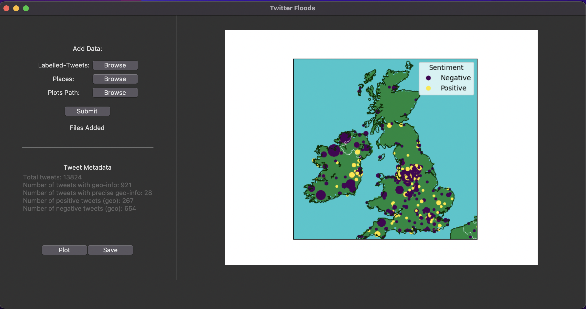

# Geotagged Tweets Basemap Plotter

A simple GUI application which generates meta data and basemap plots for tweets queried via the Twitter API.

 

## Instructions

<strong>Note:</strong> The application requires a labelled-tweets and places dataset, which at present must be formatted as JSON lines `.jsonl`.

- Load in the data sets as well as the save location for plots and press the _Submit_ button to generate metadata.
- Press the _Plot_ button to generate all plots and display a plot within the GUI.
- Press the _Save_ button to save all plots to the specified directory.
